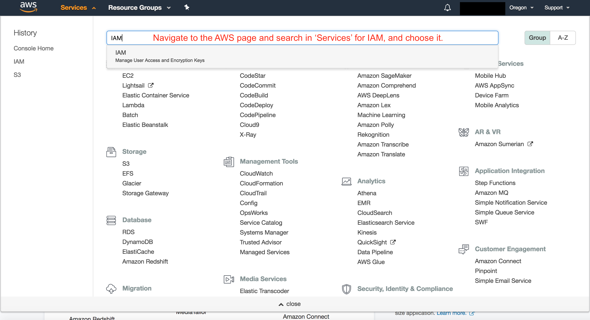
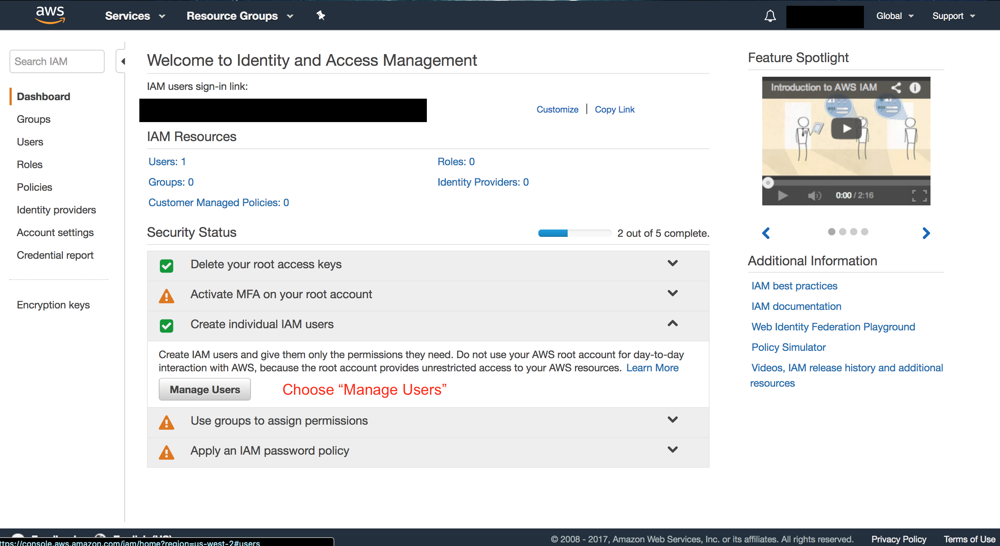
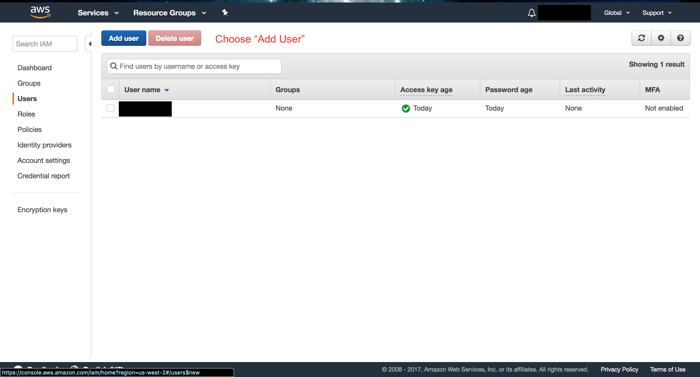
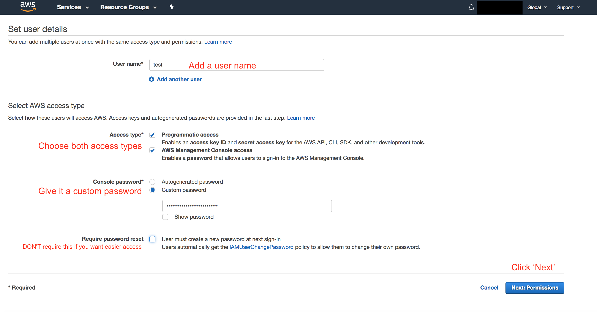
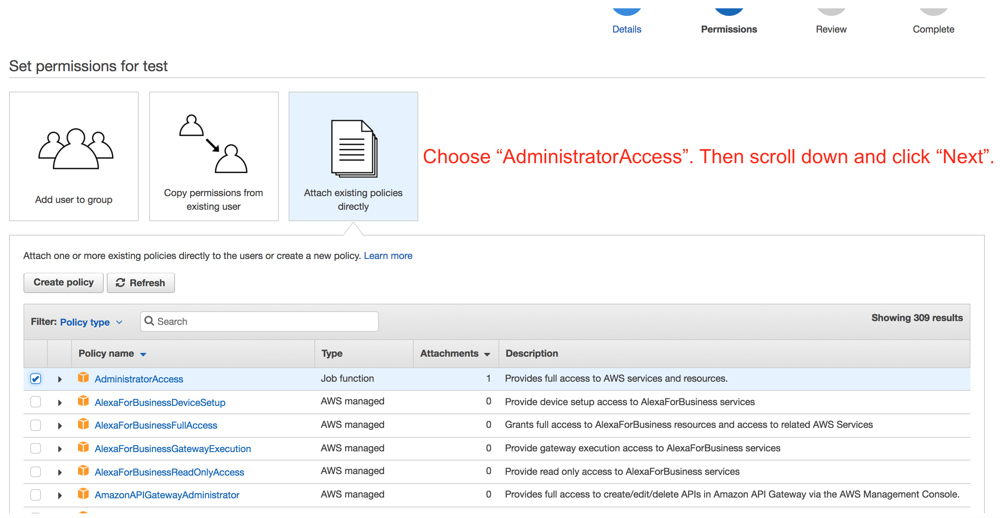
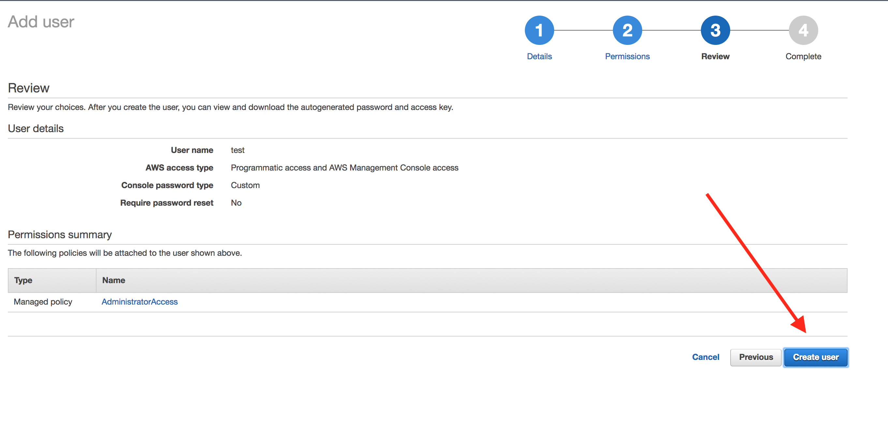
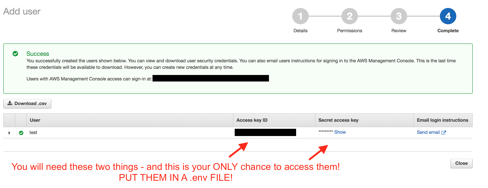

## Setting Up S3 On Amazon

The second hardest part of Amazon S3 is getting your keys and region!

## Below are the steps to get your secrets and region!

Bucket name, secret key, access key, and region should all go in your .env file.

First, make an Amazon AWS account, and then follow the steps below to get the secret key, and the access key.

Then, create a bucket: You have to choose "Products", and under "Storage" pick S3.

Click "Create Bucket", give it a name (that will be the bucket name in your .env file), and pick a region.

The region in your .env file will actually be a code found [here](http://docs.aws.amazon.com/general/latest/gr/rande.html)- the name of your region is in the first column, and the code that goes into your .env file as the region should be the corresponding entry of the second column.

Good luck!

